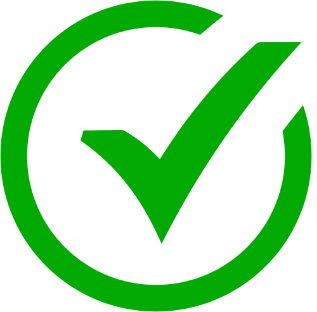
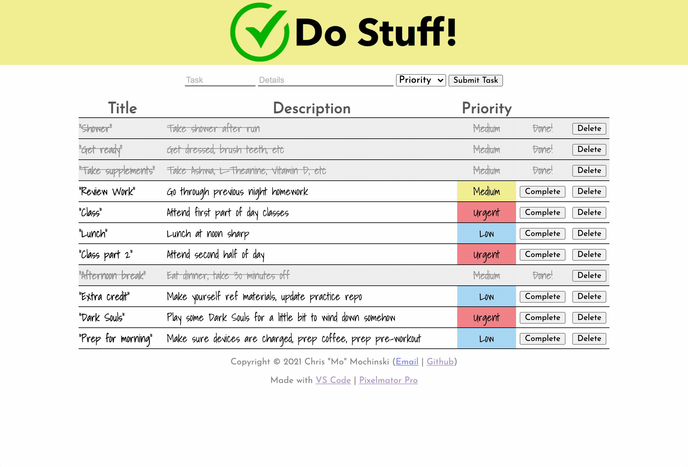

 # 
 <b>Weekend To-Do List</b> 

## <b>This application acts as a simple, attractive, multi-feature to-do list.</b>
 

---

#### _Duration: Two-Day Sprint_ 

The "Do Stuff!" web app allows a user to input a task and description, as well as priority level, into a to-do list.

The user is also able to mark a task as complete and even delete the task from the list altogether. 

---

 

### Prerequisites
---
- Internet browser application (e.g. Chrome, Safari)
   

## Installation
---
- No particular installation steps are required.
 
 
## Usage
---
##### _please note that steps 1 - 3 do not have to happen in any particular order_

1. Enter task title (_required_)
2. Enter task description (_required_)
3. Select priority level from dropdown menu (_required_)
4. Press the  button to submit your task to the list
5. At any point, press the  button to mark a task as complete
6. At any point, press the  button to remove a task from the list
  

## Built with
---
### [Visual Studio Code](https://code.visualstudio.com/), [Pixelmator Pro](https://www.pixelmator.com/pro/)
 

## License
---
N/A

 

## Acknowledgement
---
Thanks to my instructors and everyone at [Prime Digital Academy](www.primeacademy.io) for giving me the tools to do some really rad stuff. 

##### _Honorable mention - my lovely fiancée [Sharesa Golish](https://www.instagram.com/sharesadoeshair/) for the patience, support, creative opinions...and haircut._  

## Support
---
If you have questions or issues, please do not hesitate to email me at: [cmochinski@gmail.com](mailto:cmochinski@gmail.com). I'd love to hear from you!

---
 

<br/ >

##### _[My Twitter (@HolyMosesMusic)](https://twitter.com/holymosesmusic)_ 
##### _[My GitHub](https://github.com/chrismochinski)_ 
##### _[My LinkedIn](https://www.linkedin.com/in/chrismochinski/)_ 
